# How to upgrade Geeetech A10 with TMC2209 in UART Mode
I want to show here how to use [TMC2209 Driver](https://www.trinamic.com/fileadmin/assets/Products/ICs_Documents/TMC2209_Datasheet_V103.pdf) with the Geeetech A10 in UART Mode (mainly for Marlin but Klipper below!).

First of all have a look at the [board](http://geeetech.com/forum/download/file.php?id=4635) and the [schematic](https://github.com/Geeetech3D/Diagram/blob/master/GT2560_V3.0_SCH.pdf) (GT2560 v3!).
Under the X-Axis Driver is a not populated header called "UART". This can be used to software control all TMC 2209 Driver via UART.

The jumper you can set underneath the driver are not only for the Step-Configuration, but you can also use them to give them an address on the UART-"Bus". More information on it [here](https://wiki.fysetc.com/Silent2209/) and [here](https://learn.watterott.com/silentstepstick/pinconfig/tmc2209/)
The pins MS1 and MS2 have an internal pull-down resistor, so if you set both jumpers MS1 and MS2 the driver has the address 3.

## How to do it step-by-step:

 **_I am not responsible for your hardware or software. You do this at your own risk._**

### Hardware:
1. First you need to solder a new header to the unpopulated UART-Header on the board. I was lazy and did this from above - not very clean but doable.  

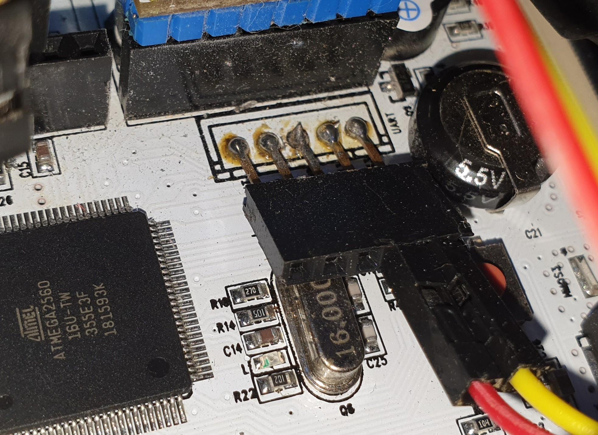

2. You need to cut the driver TX and RX Pins, because the GT2560 Board is for A4988 Driver and have other functions (MS3 and RST)  

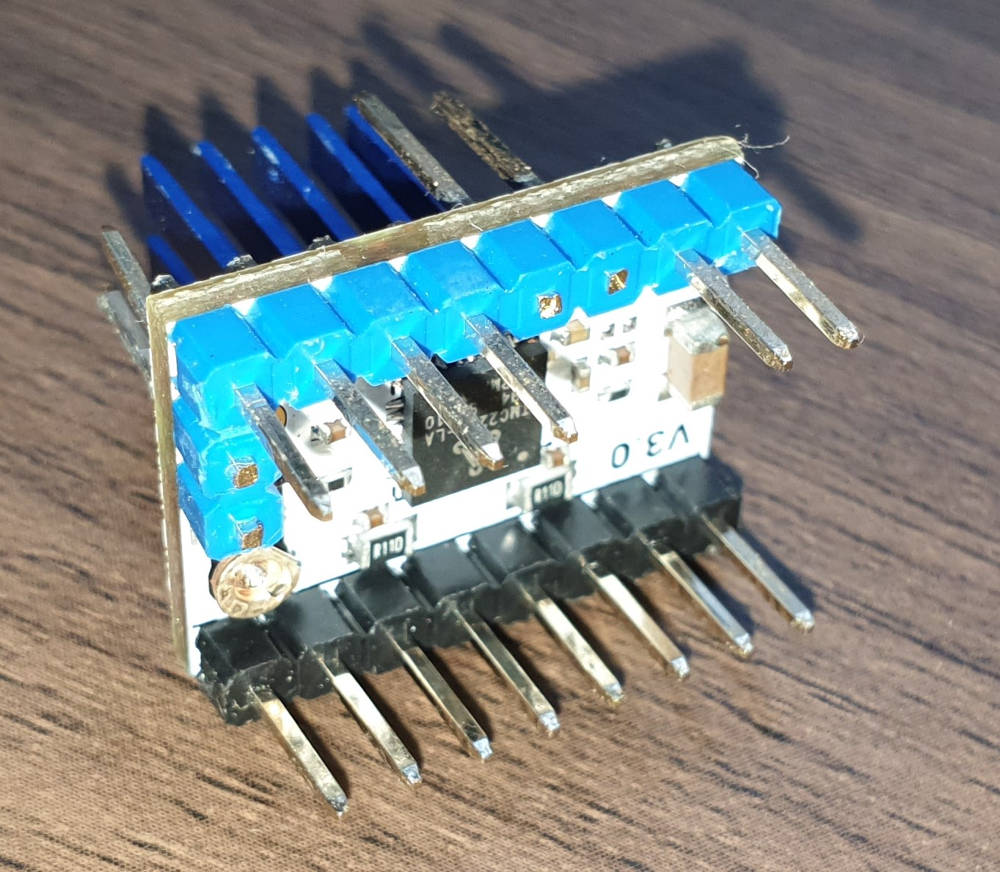  
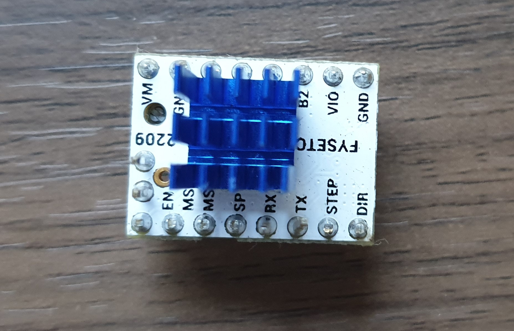  

3. Next you have to put in the jumper for each driver and give each one a drifferent adddress. Write down which driver you give which address! (the picture only shows it for one driver with address 2!)  

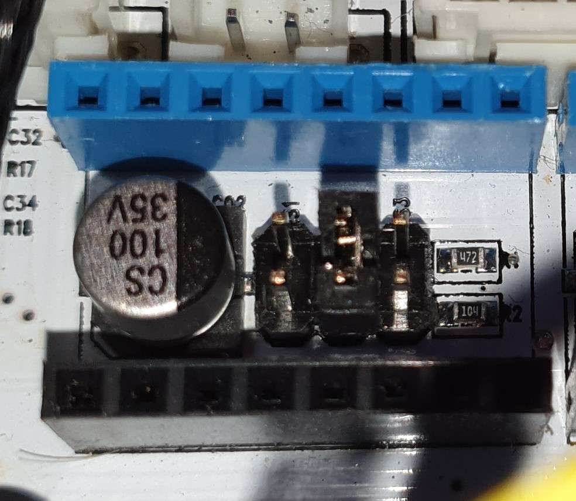  

4. You need to cut and solder some wires so you can connect one pin from the header to all 4 drivers. You need one two wires like this - one for TX and one for RX.

5. You put in the driver (**make sure they are in the correct direction**) - for me the color blue and black did not match with the board!

6. You connect the wires to the header and the drivers (RX to RX and TX to TX and **not crossed** like you know it from UART )

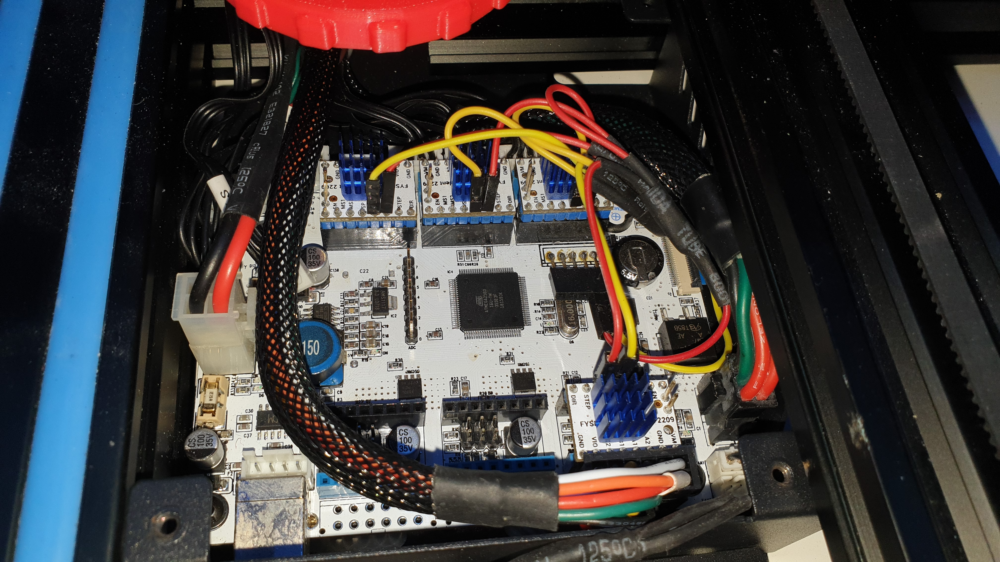

The hardware is done!

### Firmware:

Now it is time for the firmware. You need [Marlin 2](https://marlinfw.org/meta/download/) for this as far as I know.
I use [Arduino](https://www.arduino.cc/en/Main.Software) to edit and flash the firmware.
In Configuration.h:
1. Change the driver type to TMC2209 (not TMC2209_STANDALONE!)  

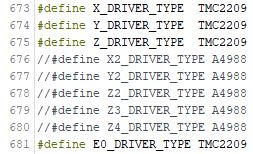  

In Configuration_adv.h:
1. Define the pins to use for UART and set the baudrate - on this board Serial3 and 115200   

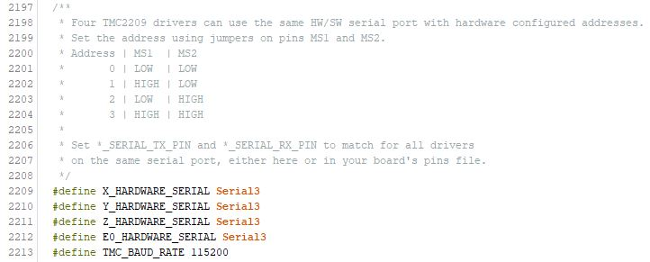  

2. Define the addresses for each driver (X is really address 0 for me)  

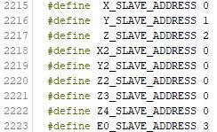  

3. (Optional) Now you can do additional configurations for the driver. For example if they should use stealthchop by default or set a hybrid threshold.  

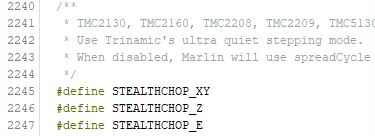  

I highly recommend turning on TMC_DEBUG for a first test!

You can find a lot more information on the [Marlin documentation](https://marlinfw.org/docs/hardware/tmc_drivers.html).

I don't use sensorless homing so I can not tell you how to use it. You can find my configuration with BLTouch [here](https://github.com/Jonas2903/Marlin-Geeetech-A10-TMC2209-UART-BLTouch).

4. Now it is time to flash the firmware.

### Test your connection

After uploading and turning on the printer you can send G-Code "M122" to test your configuration.
I used the Terminal on my OctoPrint:  

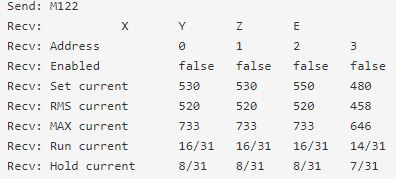  
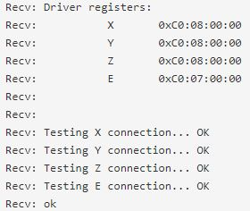  

You can also change settings for the driver with the LCD and rotatry encoder under "Configuration" -> "Advanced Settings" -> "TMC Drivers"   
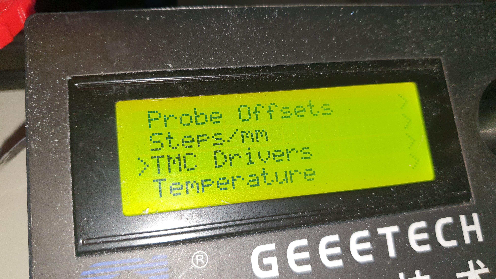   

## Klipper
I am currently switching from Marlin to [Klipper](https://github.com/KevinOConnor/klipper) so I add my config for it here too:

### Hardware
Same as above, but you __only need the RX-Wire (yellow)__.
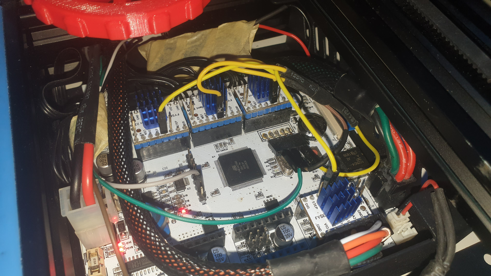

The other wires are for my other upgrades like exhaust fan and chamber temperature.

### Software

For each stepper you need to add a section like this:

```bash
[tmc2209 stepper_x]
uart_pin: PJ0
uart_address: 0
interpolate: True
run_current: 0.55
hold_current: 0.5
sense_resistor: 0.110
stealthchop_threshold: 9999
```

The pin `PJ0` is RX3 on the PCB. Change the `uart_address` according to the address you set with the jumpers.

## UNTESTED: Geeetech A10 with GT2560 v4 (no jumpers) and without cutting the driver pins  

The new Geeetech A10 [GT2560 v4 board](https://www.geeetech.com/gt2560-v40-control-board-for-a10-printer-p-1146.html) does not have jumpers and no schematic is available so far. So there are no jumpers to set the address of the driver.  
A workaround is to insert connectors between the driver and the board. The pins can be cut to set a different address for each driver.  
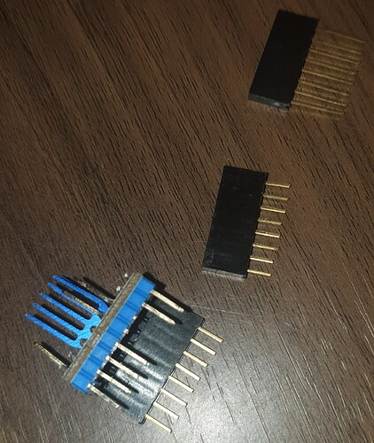  

1. Cut the connectors to the correct length
2. Cut the pins for PDN-UART (TX/RX)
3. Cut the pins MS1 and/or MS2 for each driver differently (Pin = 1 and no Pin = 0) to set the address
4. Insert the connectors to the driver and the board

I tried this on my GT2560 v3 board and it worked.  
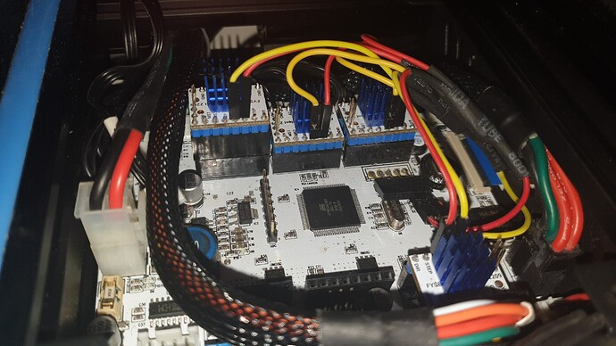  

The drivers fit very tigth in the case, because of the TX/RX wiring - maybe bend them over?!  

Another difference to the v3 board is the UART connector. It has a different pin layout and is populated.  
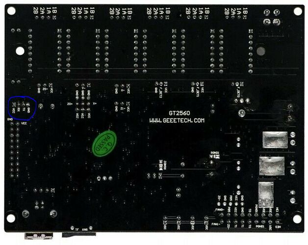  
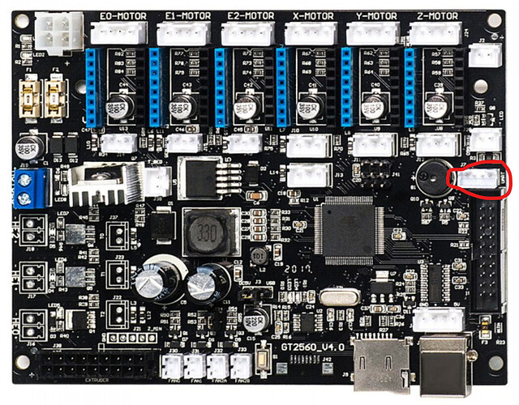  

Viewed from above:  

1 | 2 | 3 | 4
:----: | :----: | :----: | :----:
GND | Tx | Rx | Vcc

## BIGTREETECH v1.2

BIGTREETECH v1.2 TMC2209 drivers do not have directly TX/RX pins instead two PDN-UART pins.
Please read [here](https://github.com/bigtreetech/BIGTREETECH-TMC2209-V1.2/blob/master/manual/TMC2209-V1.2-manual.pdf) in **chapter 8** how to use them.
